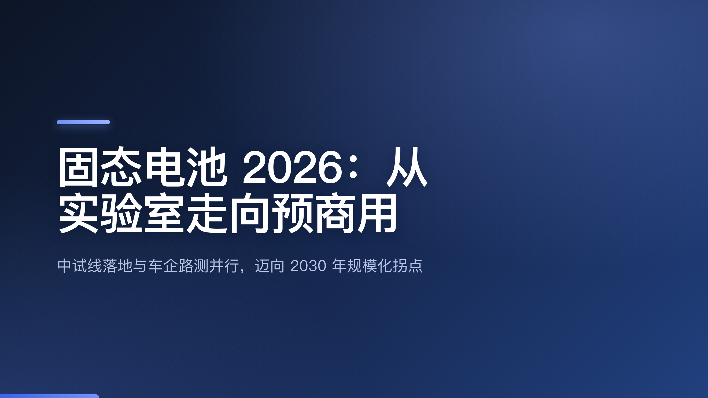
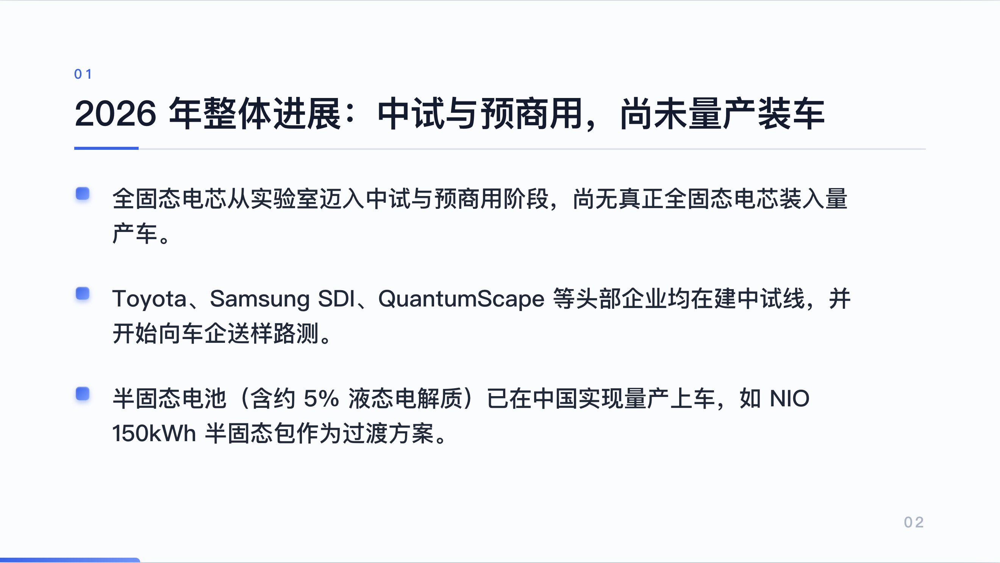
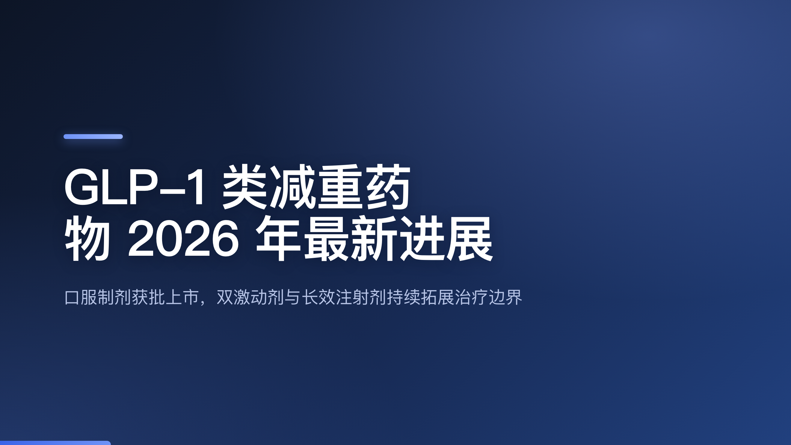
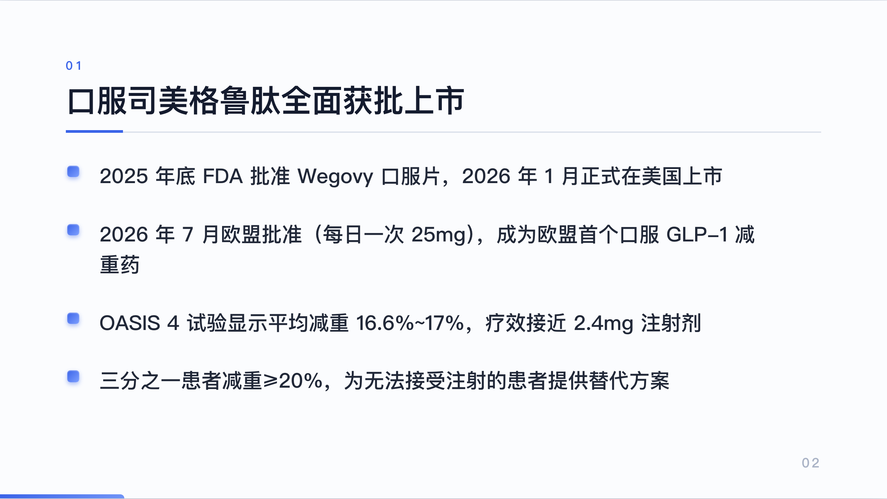
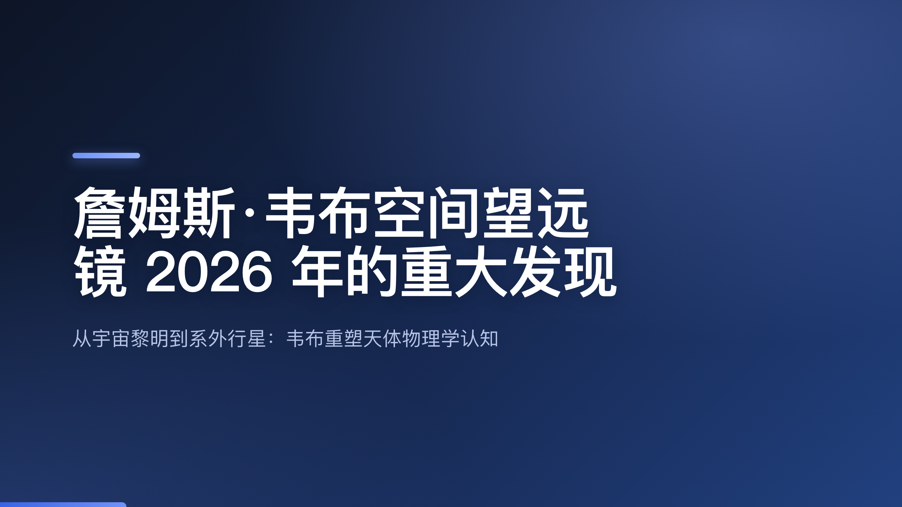
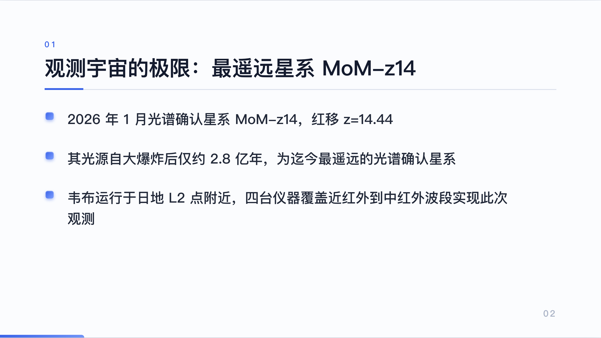
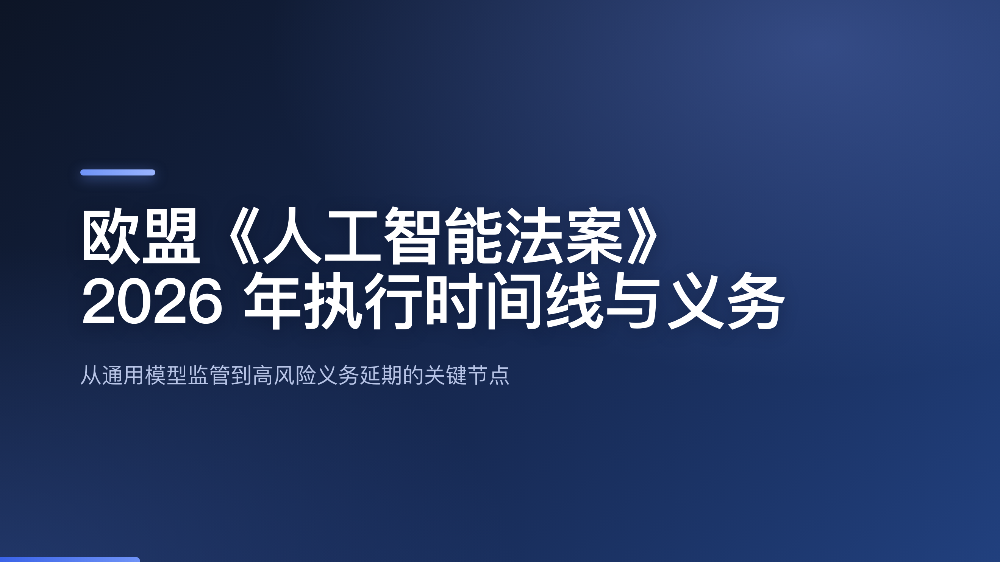
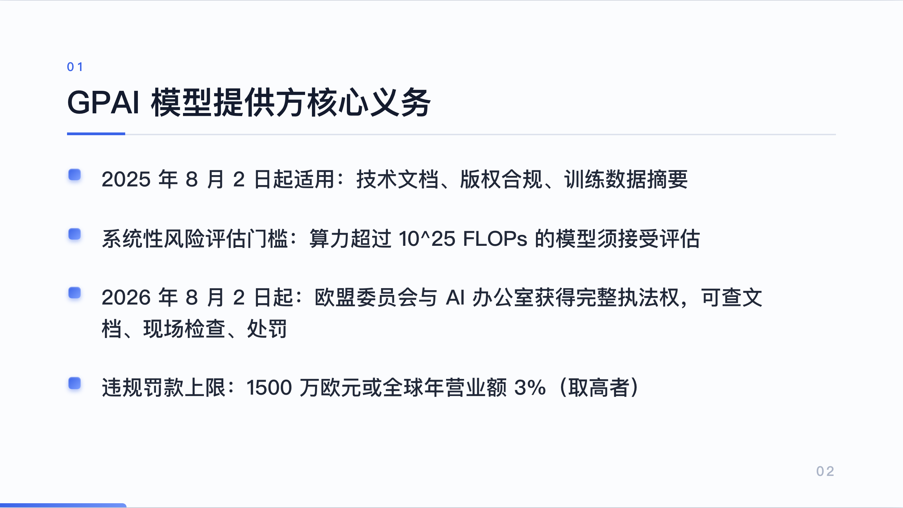
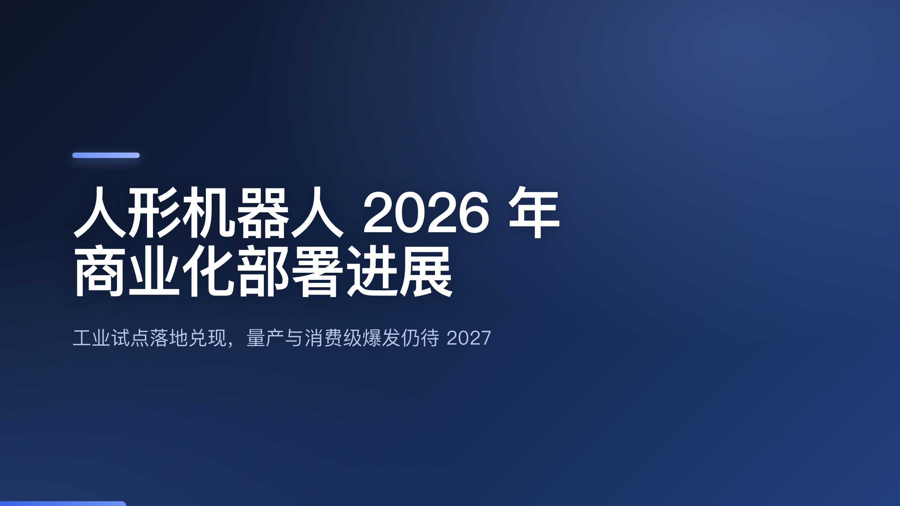
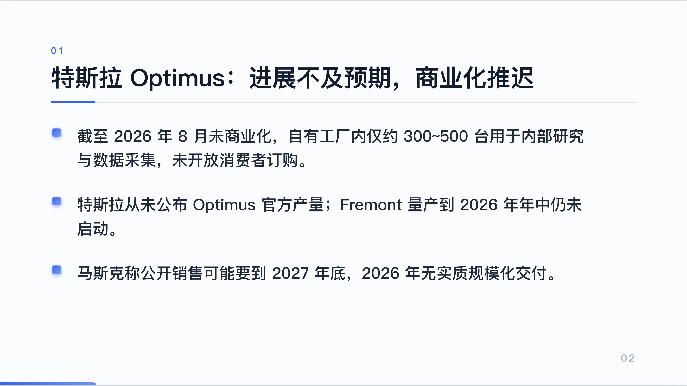

# App stress test — 5 researched topics → 5 generated PPTs (real GLM)

Each deck was produced by the packaged app path (`autooffice generate-deck` / `EngineService.createDeckFromTopic`): a web-researched topic + notes → GLM produces a structured `DeckSpec` → Slidev render. Every deck below used GLM and is information-dense and factually grounded. Cover + one content slide shown per topic.

## 1 · 固态电池 2026（能源/电动车）— 5 slides

- 全固态电芯从实验室迈入中试与预商用，尚无真正全固态电芯装入量产车
- Toyota、Samsung SDI、QuantumScape 建中试线并向车企送样路测
- 半固态电池（NIO 150kWh 半固态包）已量产上车作为过渡

## 2 · GLP-1 减重药 2026（医药/健康）— 6 slides

- 2025 年底 FDA 批准 Wegovy 口服片，2026 年 1 月在美上市
- 2026 年 7 月欧盟批准（每日一次 25mg），欧盟首个口服 GLP-1 减重药
- OASIS 4 平均减重 16.6%~17%，疗效接近 2.4mg 注射剂

## 3 · 韦布望远镜 2026 发现（空间科学）— 6 slides

- 2026 年 1 月光谱确认星系 MoM-z14，红移 z=14.44
- 其光源自大爆炸后仅约 2.8 亿年，为迄今最遥远的光谱确认星系
- 韦布运行于日地 L2 点附近，四台仪器覆盖近红外到中红外

## 4 · 欧盟 AI 法案 2026（政策/法律）— 6 slides

- GPAI 义务自 2025-08-02 起：技术文档、版权合规、训练数据摘要
- 系统性风险评估门槛：算力超过 10^25 FLOPs 的模型须评估
- 2026-08-02 起委员会/AI 办公室获完整执法权（查文档、现场检查、处罚）

## 5 · 人形机器人 2026（机器人/产业）— 6 slides

- 截至 2026-08 未商业化，自有工厂内约 300~500 台仅作内部研究/数采
- 特斯拉从未公布 Optimus 官方产量，Fremont 量产年中未启动
- 马斯克称公开销售或到 2027 年底，2026 无实质规模化交付

> Generated headless via GLM (capability 1000); 5/5 decks used the LLM and produced 5–6 slides with 10–13 grounded bullets each. `generate-deck` also exported a real **PPTX (808 KB)** in the CLI smoke test.
