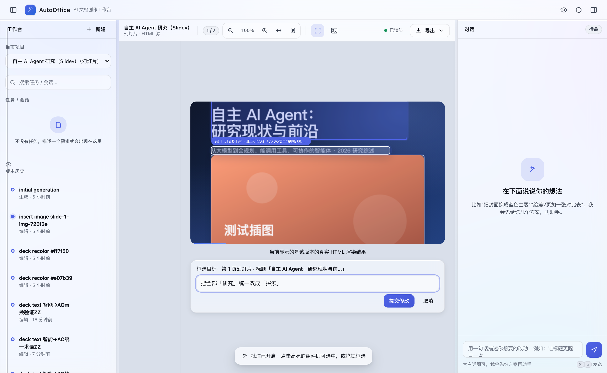
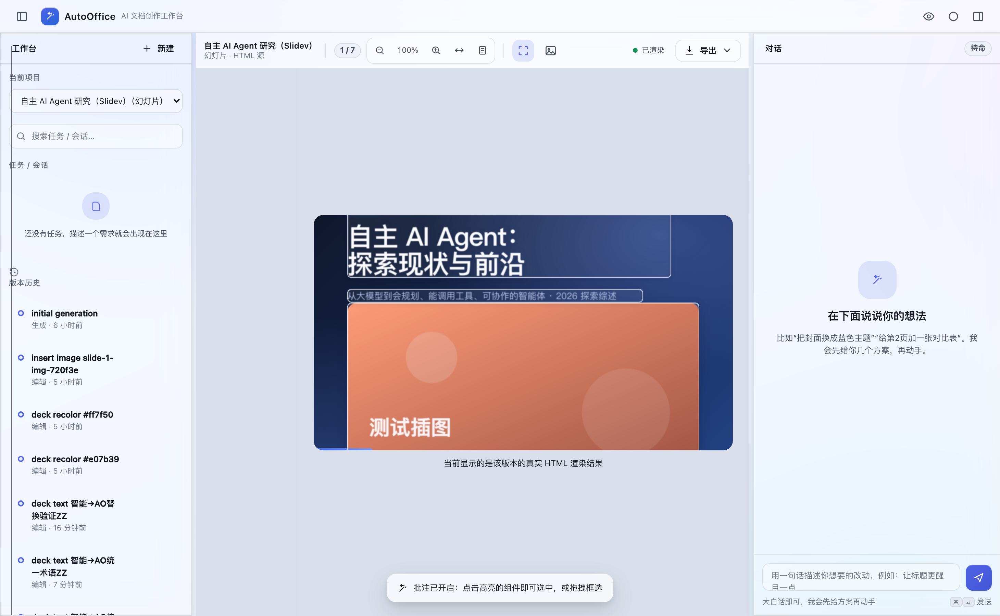
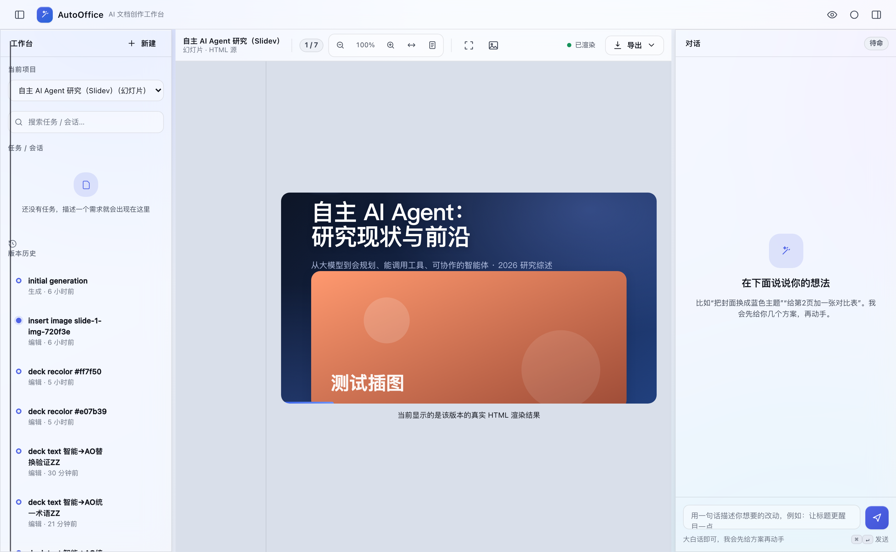

# Deck-wide box-select editing — browser demos

Real `/aoide/` app screenshots (managed preview on the fixed port), captured with Playwright. Every demo edit is undone afterwards to restore the baseline.

## 1) Deck-wide term unification —「把全部『研究』统一改成『探索』」

Frame one component, and the term is renamed across **every** slide (deterministic, no LLM); image `alt` captions are kept in sync too.

| Step | Screenshot |
|---|---|
| ① Slidev deck loaded in the real app |  |
| ② "框选修改" → liquid-glass selectable hotspots |  |
| ③ Click a hotspot, type the instruction |  |
| ④ Whole deck re-renders: 研究 → 探索 (cover title + subtitle) |  |
| ⑤ Undo restores the baseline |  |

## 2) Deck-wide semantic unification (GLM) —「把整册的语气和表述统一得更专业、更一致」

A whole-deck instruction with **no explicit A→B** routes to a GLM pass that rewrites many nodes consistently (16 nodes in this run), one undoable revision.

| Step | Screenshot |
|---|---|
| ① Baseline deck |  |
| ② Annotate mode |  |
| ③ Vague, no-A→B instruction |  |
| ④ GLM unifies 16 nodes deck-wide (subtitle rewritten more professionally) |  |
| ⑤ Undo restores the baseline |  |

> Routing (`src/engine/skills.ts`): color → deck recolor; text A→B → deck rename (`deckTextReplace`, syncs `alt`); text global no-A→B → GLM `deckSemanticUnify`; else local. Semantic unify uses a forceful retry so even a vague「统一一下」reliably produces edits.
